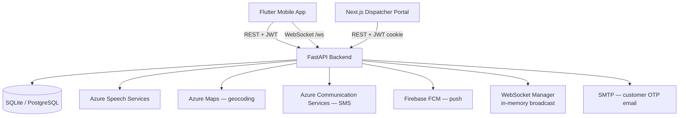

# NearDrop — Intelligent Last-Mile Delivery Recovery

NearDrop intercepts failed deliveries in real time and broadcasts them to a geo-proximate network of community micro-hubs (kirana stores, pharmacies, apartment receptions). When a driver marks a delivery as failed, the DeadMile Engine finds available hubs within 2 km, broadcasts the package offer over WebSocket, and reroutes the driver to the first accepting hub — eliminating retry trips and building a verifiable trust record for every actor in the chain.

---

## Project Structure

```
NearDrop/
├── backend/                        # FastAPI backend
│   ├── routes/                     # Auth, delivery, hubs, driver, dashboard, dispatcher, voice
│   ├── services/                   # Azure Maps, Azure SMS, Firebase FCM, queue engine, email
│   ├── models.py                   # SQLAlchemy ORM models
│   ├── schemas.py                  # Pydantic v2 request/response schemas
│   ├── database.py                 # Async SQLAlchemy engine + session
│   ├── auth.py                     # JWT creation/validation, bcrypt hashing
│   ├── websocket_manager.py        # In-memory WebSocket connection registry
│   ├── main.py                     # FastAPI app factory, middleware, routers
│   ├── seed.py                     # Hyderabad mock data (5 drivers, 8 hubs, 50 deliveries, 1 dispatcher, 2 batches)
│   ├── requirements.txt
│   ├── Dockerfile
│   └── startup.sh
├── dispatcher/                     # Next.js 14 dispatcher web portal
│   ├── app/
│   │   ├── api/                    # auth/login, auth/logout, backend proxy
│   │   └── dashboard/              # Dashboard, drivers, deliveries pages
│   ├── components/                 # StatsBar, DriverCard, CSVUploadModal, DeliveryTable, Sidebar
│   ├── lib/                        # api.ts (typed helpers), types.ts
│   ├── middleware.ts                # JWT route protection
│   ├── package.json
│   └── tailwind.config.ts
├── mobile/                         # Flutter mobile app (BLoC + feature-first)
│   ├── lib/
│   │   ├── core/                   # Config, theme, network, DI, storage
│   │   ├── features/               # auth/, driver/, hub/
│   │   └── shared/                 # Widgets, models
│   ├── android/
│   ├── assets/
│   ├── pubspec.yaml
│   └── pubspec.lock
├── .env.example                    # All environment variables with comments
├── .gitignore
├── docker-compose.yml              # Backend + PostgreSQL for local Docker dev
└── README.md
```

---

## Prerequisites

| Tool | Version |
|---|---|
| Python | 3.11+ |
| Flutter | 3.19.0+ |
| Dart SDK | 3.3.0+ |
| Docker + Docker Compose | Latest stable |
| Android SDK | API 21+ (for mobile) |

---

## Quick Start — Local Development

### 1. Clone and configure environment

```bash
git clone https://github.com/your-org/neardrop.git
cd NearDrop
cp .env.example .env
```

Open `.env` and fill in at minimum:
```
JWT_SECRET_KEY=<generate with: python -c "import secrets; print(secrets.token_hex(32))">
```
All other values are optional for local dev — Azure and Firebase services degrade gracefully if keys are missing.

---

### 2. Backend setup

#### Option A: Docker (recommended — includes PostgreSQL)

```bash
docker compose up --build
```

The API will be available at `http://localhost:8000`.
API docs (Swagger UI) at `http://localhost:8000/docs`.

To seed mock data into the running container:
```bash
docker compose exec backend python seed.py
```

#### Option B: Manual (SQLite, no Docker required)

```bash
cd backend
python -m venv venv
source venv/bin/activate          # Windows: venv\Scripts\activate
pip install -r requirements.txt

# Copy and configure environment
cp ../.env.example ../.env

# Seed Hyderabad mock data
python seed.py

# Start dev server
uvicorn main:app --reload --port 8000
```

API available at `http://localhost:8000`. Swagger UI at `http://localhost:8000/docs`.

---

### 3. Azure credentials — where to get them

All Azure keys go in your root `.env` file. Every service degrades gracefully if the key is missing, so you only need to configure what you actually use.

| Variable | Service | Where to find it |
|---|---|---|
| `AZURE_SPEECH_KEY` | Azure Cognitive Services — Speech | portal.azure.com → your Speech resource → **Keys and Endpoint** |
| `AZURE_SPEECH_REGION` | Azure Cognitive Services — Speech | Same page, e.g. `eastus` or `centralindia` |
| `AZURE_MAPS_SUBSCRIPTION_KEY` | Azure Maps | portal.azure.com → your Maps account → **Authentication** tab |
| `AZURE_COMMUNICATION_CONNECTION_STRING` | Azure Communication Services (SMS) | portal.azure.com → your ACS resource → **Keys** |
| `AZURE_COMMUNICATION_SENDER_PHONE` | Azure Communication Services (SMS) | portal.azure.com → your ACS resource → **Phone numbers** |

---

### 3b. SMTP setup (customer OTP emails)

OTP emails are sent when a hub accepts a package. Configure these in `.env`:

```
SMTP_HOST=smtp.gmail.com
SMTP_PORT=587
SMTP_USER=your-gmail@gmail.com
SMTP_PASSWORD=your-app-password        # Gmail: use an App Password, not your account password
SMTP_SENDER_NAME=NearDrop
```

If these variables are absent the hub-accept endpoint still succeeds — OTP generation is skipped silently.

---

### 4. Firebase setup (push notifications)

Push notifications are optional. The app works without Firebase — FCM calls are fire-and-forget.

1. Go to [console.firebase.google.com](https://console.firebase.google.com) and create a project.
2. Add an **Android app** with package name `com.neardrop.app`.
3. Download `google-services.json` and place it at `mobile/android/app/google-services.json`.
4. In Project Settings → **Service Accounts** → click **Generate new private key**.
5. Open the downloaded JSON file, copy the entire contents, and paste it as a single-line string into `.env`:
   ```
   FIREBASE_SERVICE_ACCOUNT_JSON={"type":"service_account","project_id":"..."}
   ```

---

### 5. Flutter mobile app setup

```bash
cd mobile
flutter pub get
```

**Configure the backend URL** in `mobile/lib/core/config/app_config.dart`:

| Scenario | Value for `baseUrl` |
|---|---|
| Android emulator (default) | `http://10.0.2.2:8000` |
| Physical device on same WiFi | `http://192.168.X.X:8000` (your machine's LAN IP) |
| Production | `https://neardrop-api.azurewebsites.net` |

Run on a connected device or emulator:
```bash
flutter run
```

---

### 6. Dispatcher portal setup

```bash
cd dispatcher
npm install
npm run dev
# Runs at http://localhost:3000
```

The dispatcher portal proxies all API calls to the FastAPI backend. Make sure the backend is running on port 8000 before opening the portal.

---

### 7. Test credentials (seeded)

Run `python seed.py` (or `docker compose exec backend python seed.py`) to populate the database, then log in with:

| Role | Credential | Password |
|---|---|---|
| Driver | Phone: 9000000001 | driver123 |
| Driver | Phone: 9000000002 | driver123 |
| Driver | Phone: 9000000003 | driver123 |
| Hub Owner | Phone: 9000000004 | hub123 |
| Hub Owner | Phone: 9000000005 | hub123 |
| Hub Owner | Phone: 9000000006 | hub123 |
| Dispatcher | Email: dispatcher@neardrop.in | dispatch123 |

Hub owner `9000000004` (Sri Ram Kirana Store) has a pre-accepted broadcast with pickup code **847291**.

---

### Dispatcher portal — batch CSV format

Upload a CSV file on the Dispatcher dashboard to assign a delivery batch to a driver. Required columns:

```
delivery_id,customer_name,customer_email,customer_phone,delivery_address
ND10001,Priya Sharma,priya@gmail.com,9876543210,"Flat 12 Jubilee Hills Hyderabad 500033"
ND10002,Rahul Verma,rahul@gmail.com,9876543211,"Plot 45 Gachibowli Hyderabad 500032"
```

| Column | Required | Description |
|---|---|---|
| `delivery_id` | Yes | Unique order reference (e.g. `ND10001`) |
| `customer_name` | Yes | Recipient display name |
| `customer_email` | Yes | Used to send hub drop OTP |
| `customer_phone` | Yes | 10-digit mobile number |
| `delivery_address` | Yes | Full text address — geocoded via Azure Maps |

The backend geocodes all addresses concurrently, then runs the nearest-neighbor queue ordering engine to sequence stops optimally before assigning the batch to the driver.

---

## Deployment — Azure App Service

### 1. Build and push the Docker image

```bash
# Log in to Azure Container Registry
az acr login --name <your-registry-name>

# Build and tag
docker build -t <your-registry-name>.azurecr.io/neardrop-backend:latest ./backend

# Push
docker push <your-registry-name>.azurecr.io/neardrop-backend:latest
```

### 2. Deploy to App Service

```bash
az webapp create \
  --resource-group <your-rg> \
  --plan <your-plan> \
  --name neardrop-api \
  --deployment-container-image-name <your-registry-name>.azurecr.io/neardrop-backend:latest
```

### 3. Set environment variables

In the Azure Portal: **App Service → Configuration → Application settings**, add every variable from `.env.example` with your production values.

Or via CLI:
```bash
az webapp config appsettings set \
  --resource-group <your-rg> \
  --name neardrop-api \
  --settings DATABASE_URL="postgresql+asyncpg://..." JWT_SECRET_KEY="..." ...
```

---

## Architecture



### Key design decisions

| Decision | Current implementation | Production path |
|---|---|---|
| Database | SQLite (dev) / PostgreSQL (prod) | Azure PostgreSQL Flexible Server |
| Geosearch | Haversine in Python, loads all hubs | PostGIS `ST_DWithin` with GIST index |
| WebSocket | In-memory `ConnectionManager` | Redis pub/sub (multi-worker safe) |
| Auth | JWT, 30-day expiry, bcrypt passwords | Same — no changes needed |
| Push notifications | Firebase FCM, fire-and-forget | Same |
| Geocoding | Azure Maps, concurrent via `asyncio.gather` | Same |
| Queue ordering | Nearest-neighbor greedy Haversine | OR-Tools VRP solver for large batches |
| OTP email | smtplib STARTTLS via `BackgroundTasks` | SendGrid / Azure Communication Services Email |
| Dispatcher auth | Separate `Dispatcher` table, email-based JWT with `role: dispatcher` | Same |

### API routes

| Method | Endpoint | Description |
|---|---|---|
| `POST` | `/auth/login` | Phone + password login, returns JWT |
| `GET` | `/auth/me` | Current user profile |
| `GET` | `/driver/{id}/score` | Trust score + recent delivery history |
| `GET` | `/driver/{id}/active_delivery` | Current active delivery |
| `POST` | `/driver/fcm-token` | Register device push token |
| `POST` | `/delivery/fail` | Mark delivery failed, trigger hub broadcast |
| `POST` | `/delivery/{id}/complete` | Mark delivery as delivered |
| `GET` | `/hubs/nearby` | Hubs within radius of coordinates |
| `GET` | `/hubs/{id}/active_broadcasts` | Pending broadcasts for a hub |
| `GET` | `/hubs/{id}/stored_packages` | Packages accepted and awaiting customer OTP |
| `POST` | `/hub/accept` | Accept a broadcast, receive pickup code, send customer OTP email |
| `POST` | `/hub/confirm-pickup` | Mark package collected by customer, advance driver queue |
| `POST` | `/delivery/{id}/verify-otp` | Verify customer OTP at hub handoff |
| `POST` | `/delivery/{id}/resend-otp` | Resend OTP email to customer |
| `GET` | `/dashboard/stats` | Fleet-wide stats and CO₂ saved |
| `GET` | `/dashboard/fleet` | All driver positions and statuses |
| `GET` | `/dashboard/hourly` | Hourly delivery/failure counts |
| `GET` | `/dashboard/leaderboard` | Drivers ranked by completions + trust |
| `POST` | `/dispatcher/auth/login` | Email + password login for dispatchers |
| `GET` | `/dispatcher/drivers` | All drivers with live stats |
| `GET` | `/dispatcher/stats` | Fleet summary stats for dispatcher view |
| `POST` | `/dispatcher/batches` | Upload CSV and create a delivery batch |
| `GET` | `/dispatcher/batches` | List all batches |
| `GET` | `/dispatcher/batches/{id}` | Batch detail with ordered delivery queue |
| `GET` | `/dispatcher/deliveries` | All deliveries with filtering |
| `POST` | `/voice/azure-token` | Short-lived Azure Speech token for Flutter |
| `WS` | `/ws` | Real-time delivery events |
| `GET` | `/health` | Health check |
