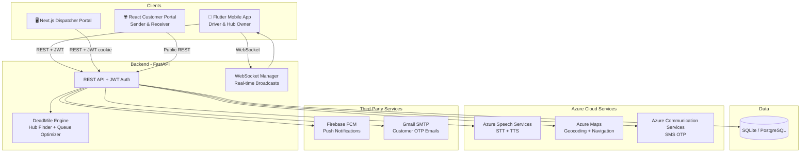

<div align="center">

# 🚀 NearDrop
### Intelligent Last-Mile Delivery Recovery Platform

*When a delivery fails, NearDrop doesn't give up — it reroutes.*

[](https://python.org)
[](https://fastapi.tiangolo.com)
[](https://flutter.dev)
[](https://nextjs.org)
[](https://opensource.org/licenses/MIT)

</div>

---

## What is NearDrop?

NearDrop intercepts failed deliveries in real time and broadcasts them to a geo-proximate network of community micro-hubs — kirana stores, pharmacies, apartment lobbies. When a driver marks a delivery as failed, the **DeadMile Engine** finds available hubs within 2 km, broadcasts the package offer over WebSocket, and reroutes the driver to the first accepting hub — eliminating wasted retry trips and building a verifiable trust record for every actor in the chain.

---

## System Architecture



---

## Project Structure

```
NearDrop/
├── backend/                        # FastAPI backend (Python)
│   ├── routes/                     # auth, delivery, hubs, driver, dashboard, dispatcher, voice, navigation
│   ├── services/                   # Azure Maps, Azure Speech, SMS, Firebase FCM, email, queue engine
│   ├── models.py                   # SQLAlchemy ORM models
│   ├── schemas.py                  # Pydantic v2 request/response schemas
│   ├── database.py                 # Async SQLAlchemy engine + session factory
│   ├── auth.py                     # JWT creation/validation, bcrypt password hashing
│   ├── websocket_manager.py        # In-memory WebSocket connection registry
│   ├── main.py                     # FastAPI app factory, CORS, JWT middleware, routers
│   ├── seed.py                     # Hyderabad mock data — 5 drivers, 8 hubs, 50 deliveries
│   ├── requirements.txt
│   └── Dockerfile
│
├── dispatcher/                     # Next.js 14 web portal for dispatchers
│   ├── app/
│   │   ├── api/                    # auth/login, auth/logout, backend proxy routes
│   │   └── dashboard/              # Dashboard, Drivers, Deliveries, Hubs pages
│   ├── components/                 # StatsBar, DriverCard, CSVUploadModal, DeliveryTable, Sidebar
│   ├── lib/                        # api.ts (typed API helpers), types.ts
│   └── middleware.ts               # JWT-based route protection
│
├── customer_portal/                # Vite + React public portal for senders & receivers
│   ├── src/
│   │   ├── components/             # Reusable UI components
│   │   └── pages/                  # Home, FreightIQ, Tracking, Contact
│   └── index.css                   # Premium vanilla CSS styling
│
├── mobile/                         # Flutter mobile app (BLoC + Feature-first architecture)
│   ├── lib/
│   │   ├── core/                   # AppConfig, theme, network, DI (GetIt), secure storage
│   │   ├── features/
│   │   │   ├── auth/               # Login, JWT persistence
│   │   │   ├── driver/             # Active delivery map, navigation, voice, trust score
│   │   │   └── hub/                # Broadcasts, OTP verification, earnings, stored packages
│   │   └── shared/                 # Reusable widgets, API response models
│   ├── android/
│   └── pubspec.yaml
│
├── .env                            # All environment variables (see configuration guide below)
├── docker-compose.yml              # Backend + PostgreSQL for local Docker dev
└── README.md
```

---

## Prerequisites

| Tool | Minimum Version | Notes |
|---|---|---|
| Python | 3.11+ | Backend runtime |
| Flutter | 3.19.0+ | Mobile app |
| Dart SDK | 3.3.0+ | Included with Flutter |
| Node.js | 18+ | Dispatcher portal |
| Docker + Docker Compose | Latest stable | Optional; required for the Docker dev path |
| Android SDK | API 35 | For physical device testing |

---

## Quick Start

### Step 1 — Clone & Configure Environment

```bash
git clone https://github.com/your-org/neardrop.git
cd NearDrop
cp .env .env.local   # Keep the original as a template reference
```

At minimum, set a JWT secret key in your `.env`:
```bash
# Auto-generate a secure key:
python -c "import secrets; print(secrets.token_hex(32))"
# Paste the output as the value for JWT_SECRET_KEY in .env
```

> All Azure, Firebase, and SMTP variables are **optional for local development** — every service has a graceful fallback if the key is missing.

---

### Step 2 — Start the Backend

Choose **one** of the following options:

#### Option A: Docker (Recommended — includes PostgreSQL)

```bash
docker compose up --build
```

The API will be live at `http://localhost:8000`.  
Swagger UI (interactive docs): `http://localhost:8000/docs`

To seed the database with Hyderabad mock data:
```bash
docker compose exec backend python seed.py
```

#### Option B: Manual with SQLite (No Docker required)

```bash
cd backend

# Create and activate a virtual environment
python -m venv venv
venv\Scripts\activate        # Windows
# source venv/bin/activate   # macOS / Linux

# Install dependencies
pip install -r requirements.txt

# Seed mock data
python seed.py

# Start the dev server
uvicorn main:app --reload --port 8000 --host 0.0.0.0
```

The API will be live at `http://localhost:8000`.

---

### Step 3 — Start the Web Portals

**Start the Dispatcher Portal**
```bash
cd dispatcher
npm install
npm run dev
# Runs at http://localhost:3000
```

**Start the Customer Portal (FreightIQ & Tracking)**
```bash
cd customer_portal
npm install
npm run dev
# Runs at http://localhost:5174
```

> The portals proxy API calls to the FastAPI backend. Ensure the backend is running on port 8000 first, and `AZURE_OPENAI_KEY` + `AZURE_OPENAI_ENDPOINT` are set in `.env` for FreightIQ estimation.

---

### Step 4 — Set Up the Flutter Mobile App

```bash
cd mobile
flutter pub get
```

The app automatically selects the correct backend URL based on the platform:

| Platform | URL Used | Where to change |
|---|---|---|
| **Web / Chrome** | `http://localhost:8000` | `lib/core/config/app_config.dart` |
| **Android (Physical Device)** | `http://192.168.1.7:8000` | `lib/core/config/app_config.dart` |
| **Production** | `https://neardrop-api.azurewebsites.net` | `lib/core/config/app_config.dart` |

> ⚠️ **Physical Android Device:** Update `192.168.1.7` to your machine's actual LAN IP address.  
> Find it with: `ipconfig` on Windows → look for the **IPv4 Address** under your active Wi-Fi adapter.

**Run on a connected device or browser:**
```bash
# Android (physical device)
flutter run -d <device-id>                     # use 'flutter devices' to find device ID

# Chrome (web)
flutter run -d chrome

# See all connected devices
flutter devices
```

---

## Test Credentials (Seeded Data)

Run `python seed.py` (backend) to populate the database, then log in with:

| Role | Login | Password |
|---|---|---|
| 🚗 Driver | Phone: `9000000001` | `driver123` |
| 🚗 Driver | Phone: `9000000002` | `driver123` |
| 🚗 Driver | Phone: `9000000003` | `driver123` |
| 🏪 Hub Owner | Phone: `9000000004` | `hub123` |
| 🏪 Hub Owner | Phone: `9000000005` | `hub123` |
| 🏪 Hub Owner | Phone: `9000000006` | `hub123` |
| 📋 Dispatcher | Email: `dispatcher@neardrop.in` | `dispatch123` |

> **Quick test:** Hub owner `9000000004` (Sri Ram Kirana Store) has a pre-accepted broadcast with pickup code **847291**.

---

## Configuration Guide

All configuration is managed via the `.env` file at the project root.

### Core Variables (Required for basic operation)

| Variable | Description | Example |
|---|---|---|
| `DATABASE_URL` | Database connection string | `sqlite+aiosqlite:///./neardrop.db` |
| `JWT_SECRET_KEY` | Secret for signing JWTs — **keep private** | 64-char hex string |
| `JWT_ALGORITHM` | JWT signing algorithm | `HS256` |
| `JWT_EXPIRY_DAYS` | Token validity in days | `30` |

### Azure Services (Optional — graceful fallback if absent)

| Variable | Service | Where to find it |
|---|---|---|
| `AZURE_SPEECH_KEY` | Speech-to-Text + Text-to-Speech | `portal.azure.com` → Speech resource → **Keys and Endpoint** |
| `AZURE_SPEECH_REGION` | Region for Speech (e.g. `centralindia`) | Same page as above |
| `AZURE_MAPS_SUBSCRIPTION_KEY` | Geocoding + Navigation routes | `portal.azure.com` → Maps account → **Authentication** |
| `AZURE_COMMUNICATION_CONNECTION_STRING` | SMS OTP to drivers | `portal.azure.com` → ACS resource → **Keys** |
| `AZURE_COMMUNICATION_SENDER_PHONE` | ACS sender phone number | `portal.azure.com` → ACS resource → **Phone numbers** |

### Email — Customer OTP (Optional)

Sent when a hub accepts a package. Uses Gmail SMTP with an App Password.

```env
SMTP_HOST=smtp.gmail.com
SMTP_PORT=587
SMTP_USER=your-gmail@gmail.com
SMTP_PASSWORD=your-16-char-app-password   # NOT your Gmail login password
SMTP_SENDER_NAME=NearDrop
```

> **Gmail Setup:** Enable 2FA → [myaccount.google.com](https://myaccount.google.com) → Security → **App Passwords** → Generate a 16-character password.

### Firebase — Push Notifications (Optional)

Push notifications are fire-and-forget. The app works without Firebase.

1. Go to [console.firebase.google.com](https://console.firebase.google.com) → create a project.
2. Add an **Android app** with package name `com.example.neardrop`.
3. Download `google-services.json` → place at `mobile/android/app/google-services.json`.
4. Project Settings → **Service Accounts** → **Generate new private key**.
5. Paste the entire JSON as a single line in `.env`:
   ```env
   FIREBASE_SERVICE_ACCOUNT_JSON={"type":"service_account","project_id":"..."}
   ```

### Dispatcher Portal (Next.js)

```env
NEXT_PUBLIC_API_URL=http://localhost:8000
NEXTAUTH_URL=http://localhost:3000
NEXTAUTH_SECRET=<generate with: node -e "console.log(require('crypto').randomBytes(32).toString('hex'))">
```

---

## Dispatcher Portal — CSV Batch Upload

Upload a CSV on the Dispatcher dashboard to create a delivery batch. Required columns:

```csv
delivery_id,customer_name,customer_email,customer_phone,delivery_address
ND10001,Priya Sharma,priya@gmail.com,9876543210,"Flat 12 Jubilee Hills Hyderabad 500033"
ND10002,Rahul Verma,rahul@gmail.com,9876543211,"Plot 45 Gachibowli Hyderabad 500032"
```

| Column | Required | Description |
|---|---|---|
| `delivery_id` | ✅ | Unique order reference (e.g. `ND10001`) |
| `customer_name` | ✅ | Recipient display name |
| `customer_email` | ✅ | Used to send hub-drop OTP |
| `customer_phone` | ✅ | 10-digit mobile number |
| `delivery_address` | ✅ | Full text address — geocoded via Azure Maps |

The backend geocodes all addresses concurrently, then runs the nearest-neighbor queue ordering engine to sequence stops optimally before assigning the batch to the driver.

---

## API Reference

| Method | Endpoint | Auth | Description |
|---|---|---|---|
| `POST` | `/auth/login` | — | Phone + password login → returns JWT |
| `GET` | `/auth/me` | JWT | Current user profile |
| `GET` | `/driver/{id}/score` | JWT | Trust score + recent delivery history |
| `GET` | `/driver/{id}/active_delivery` | JWT | Current active delivery |
| `POST` | `/driver/fcm-token` | JWT | Register device push token |
| `POST` | `/delivery/fail` | JWT | Mark delivery failed → triggers hub broadcast |
| `POST` | `/delivery/{id}/complete` | JWT | Mark delivery as completed |
| `GET` | `/hubs/nearby` | JWT | Hubs within 2km of coordinates |
| `GET` | `/hubs/{id}/active_broadcasts` | JWT | Pending broadcasts for a hub |
| `GET` | `/hubs/{id}/stored_packages` | JWT | Packages accepted and awaiting customer OTP |
| `GET` | `/hubs/{id}/stats` | JWT | Hub earnings and trust score |
| `POST` | `/hub/accept` | JWT | Accept broadcast → generates pickup code + sends customer OTP email |
| `POST` | `/delivery/{id}/verify-otp` | JWT | Verify customer OTP at hub handoff |
| `POST` | `/delivery/{id}/resend-otp` | JWT | Resend OTP email to customer |
| `GET` | `/dashboard/stats` | JWT | Fleet-wide stats and CO₂ saved |
| `GET` | `/dashboard/fleet` | JWT | All driver positions and statuses |
| `GET` | `/dashboard/hourly` | JWT | Hourly delivery/failure counts |
| `GET` | `/dashboard/leaderboard` | JWT | Drivers ranked by completions + trust score |
| `POST` | `/dispatcher/auth/login` | — | Email + password login for dispatchers |
| `GET` | `/dispatcher/drivers` | JWT | All drivers with live stats |
| `POST` | `/dispatcher/batches` | JWT | Upload CSV → create a delivery batch |
| `GET` | `/dispatcher/deliveries` | JWT | All deliveries with filtering |
| `GET` | `/navigation/route` | JWT | Turn-by-turn route between two coordinates |
| `POST` | `/voice/azure-token` | JWT | Short-lived Azure Speech token for Flutter |
| `GET` | `/public/track/{id}` | — | Public container tracking — live status without login |
| `POST` | `/public/freight-iq` | — | Azure OpenAI-powered market rate estimation and negotiation |
| `WS` | `/ws` | — | WebSocket — real-time delivery events |
| `GET` | `/health` | — | Health check (DB status) |

Full interactive docs available at `http://localhost:8000/docs` (Swagger UI).

---

## Design Decisions & Production Roadmap

| Concern | Current (Development) | Production Path |
|---|---|---|
| **Database** | SQLite (file-based) | Azure PostgreSQL Flexible Server |
| **Geosearch** | Haversine in Python, loads all hubs | PostGIS `ST_DWithin` with GIST index |
| **WebSocket** | In-memory `ConnectionManager` | Redis Pub/Sub (multi-worker safe) |
| **Auth** | JWT, 30-day expiry, bcrypt | Same — no changes needed |
| **Push** | Firebase FCM, fire-and-forget | Same |
| **Geocoding** | Azure Maps, concurrent via `asyncio.gather` | Same |
| **Queue ordering** | Nearest-neighbor greedy (Haversine) | OR-Tools VRP solver for large batches |
| **OTP email** | Gmail SMTP via `BackgroundTasks` | SendGrid / Azure Communication Services Email |

---

## Deployment — Azure App Service

### 1. Build and push the Docker image

```bash
# Log in to Azure Container Registry
az acr login --name <your-registry-name>

# Build, tag, and push
docker build -t <your-registry>.azurecr.io/neardrop-backend:latest ./backend
docker push <your-registry>.azurecr.io/neardrop-backend:latest
```

### 2. Create the App Service

```bash
az webapp create \
  --resource-group <your-rg> \
  --plan <your-plan> \
  --name neardrop-api \
  --deployment-container-image-name <your-registry>.azurecr.io/neardrop-backend:latest
```

### 3. Set environment variables

In the Azure Portal: **App Service → Configuration → Application Settings**, add every key from `.env`.

Or via CLI:
```bash
az webapp config appsettings set \
  --resource-group <your-rg> \
  --name neardrop-api \
  --settings \
    DATABASE_URL="postgresql+asyncpg://..." \
    JWT_SECRET_KEY="..." \
    AZURE_SPEECH_KEY="..." \
    AZURE_MAPS_SUBSCRIPTION_KEY="..."
```

### 4. Update the Flutter app for production

In `mobile/lib/core/config/app_config.dart`, update the production URL:
```dart
static String get baseUrl => kIsWeb
    ? 'https://neardrop-api.azurewebsites.net'  // web
    : 'https://neardrop-api.azurewebsites.net'; // mobile
```

---

## License

MIT © NearDrop Contributors
